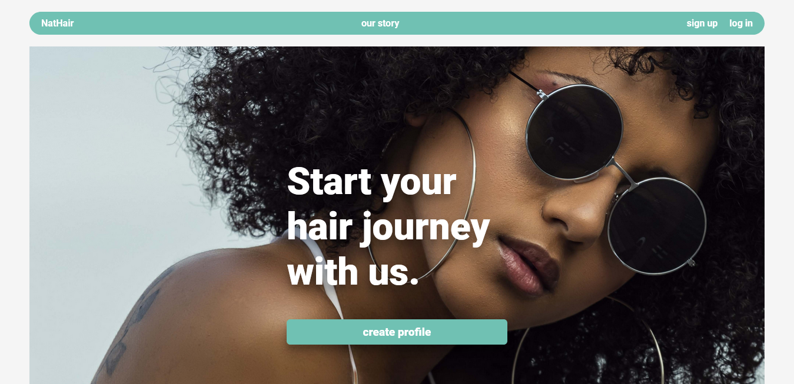

# NatHair
This is my ALX/Holberton School Portfolio Project which aims to help people with their natural hair journey.

A few years ago, I had myself started my own natural hair journey, and initially I didn't realize what a daunting task it would be. I did not know anything about hair typing, what “hair porosity” meant and how important it would be, and most importantly, I had no idea what kind of products I needed in order to build my own hair regimen. This led me to waste a lot of time and money because I was using a very frustrating method called trial and error. I had absolutely no idea what I was doing and this led me to lose confidence in my decision to go natural. This experience is what led to the idea of NatHair. I decided to do my portfolio project about something that would have helped me in the past, and could possibly help those in a similar as not worked for you, allowing you to help out your fellow naturals.situation presently and in the future.

## Project Links
### Deployed Site
<a href="https://nathair.onrender.com
">NatHair Deployed Site</a>
### Project Blog
<a href="https://www.linkedin.com/posts/prettypandey_a-few-words-about-my-alxholberton-portfolio-activity-7078079099524554752-QPWv?utm_source=share&utm_medium=member_desktop">NatHair Blog Article</a>

### Project API
<a href="">https://nathair-product-api.onrender.com
</a>

### Project API Repository
<a href="">https://github.com/pandeypearl/NatHairAPI</a>

The outcome of this idea is a web application that helps you identify every aspect of your hair and its current condition, recommends the best possible products specific to you and your personal hair issues, and provides a community space to share what has and has not worked for you, allowing you to help out your fellow naturals.

### Author
Pretty Pandey  
Full Stack Development
<a href="https://www.linkedin.com/in/prettypandey"> LinkedIn</a>

## Installation to get started with NatHair
This project is developed using Django 4.4.2

1. Clone repository from GutHub  
https://github.com/pandeypearl/NatHair
2. Install dependencies using pip install 
    Dependencies can be found in requirements.txt
3. Start server using python manage.py:  
run this command in source folder  NatHair/venvironemnt/nathair

&copy; ALX 2023git